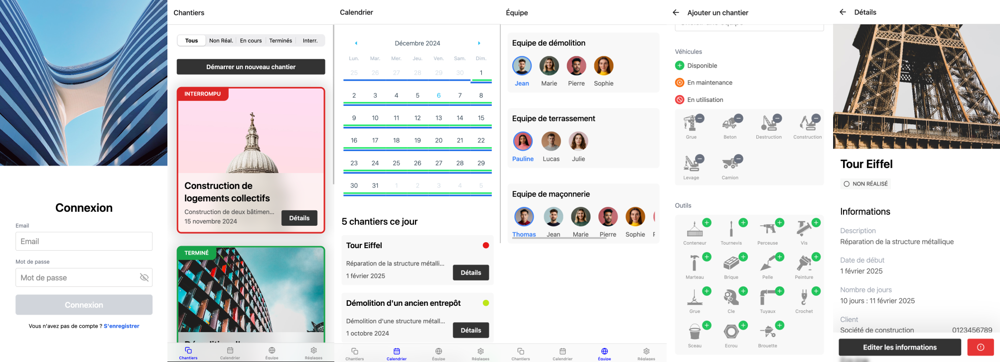

# Projet Application de Gestion de Chantiers

## **Réalisé par**  
- Alexandre Boutinaud
- Gaetan Peron

---

## **Présentation**

L’objectif principal de cette application est de fournir une solution intuitive et accessible, permettant de suivre les chantiers, gérer les équipes et optimiser la communication entre les différents intervenants.

---

## **Technologies Utilisées**

### **Back-end**
- **Firebase** :
  - **Authentification** : Gestion sécurisée des utilisateurs avec persistance de l’état d’authentification via la bibliothèque `async-storage`. Cela garantit que l'utilisateur reste connecté, quel que soit l'appareil utilisé.
  - **Firestore** : Une base de données cloud NoSQL utilisée pour stocker des données structurées, telles que les informations des chantiers, les équipes, et les anomalies signalées.

### **Front-end**
- **React Native avec Expo** :
  - Fournit une base cross-plateforme permettant de développer pour le web, iOS et Android avec une seule base de code.
  - Assure une expérience utilisateur cohérente, quel que soit le périphérique utilisé.
- **React Navigation** : Intègre une navigation simple et performante entre les différentes pages de l'application.

### **Bibliothèques principales** :
- **NativeWind (Gluestack UI)** : Une implémentation de **TailwindCSS** adaptée à React Native. Cette solution permet un style rapide et efficace, tout en rendant les composants nativement sur web, iOS et Android.
- **Segmented-Control** : Ajoute une interface intuitive pour la gestion des filtres avec des transitions fluides.
- **React-Native-Calendars** : Permet un affichage calendrier détaillé pour visualiser les périodes des chantiers.
- **MapTiler et API Geocoding** : Convertissent des adresses textuelles en coordonnées GPS pour localiser précisément les chantiers et les afficher sur une carte interactive.
- **Axios** : Gère les appels REST nécessaires, notamment pour récupérer les données depuis les services tiers ou la base Firestore.

---

## **Fonctionnalités**

### **Authentification**
- **Page dédiée** permettant aux utilisateurs de se connecter ou de créer un compte.  
- Par défaut, les nouveaux comptes sont associés au rôle **« Equipier »**, avec des restrictions d'accès adaptées.

### **Gestion des chantiers**
- **Page principale** :
  - **Affichage de tous les chantiers** sous forme de liste.
  - **Filtres** intuitifs (par statut : *Non commencé, En cours, Terminé, Interrompu*) grâce à un composant natif développé avec `Segmented-Control`.
  - Un **bouton dédié** permet de créer rapidement un nouveau chantier en saisissant les informations essentielles.
- **Calendrier** :
  - Visualisation des chantiers par période via un calendrier interactif.
  - Chaque chantier est coloré différemment pour une identification rapide et un aperçu global des activités planifiées.
- **Détails d’un chantier** :
  - Visualisation complète des informations associées au chantier, telles que les dates, les équipes et les tâches.
  - Intégration d’une **carte interactive** via **MapTiler**, permettant de localiser géographiquement le chantier.
  - **Modification des informations** du chantier directement via l’interface.
  - Consultation et création d’**anomalies**, telles que des incidents signalés sur le terrain.

### **Gestion des équipes**
- Visualisation des équipes affectées à chaque chantier, incluant :
  - Le chef d'équipe.
  - Les équipiers assignés.

### **Page de réglages**
- Fonctionnalité spécifique pour le cadre du TP : permet de **charger des données de test** afin de rapidement explorer les fonctionnalités de l’application.

---

## **Axes d’amélioration**

### **Gestion des chantiers**
- Permettre une **modification avancée** des informations d’un chantier, notamment :
  - Ajout ou retrait de véhicules associés.
  - Gestion des outils nécessaires au projet.
  - Mise à jour des équipes affectées.

### **Équipes**
- Intégrer une interface complète pour la **gestion des équipes**, permettant :
  - La création de nouvelles équipes.
  - La modification des membres.
  - Une visualisation enrichie des équipes et de leurs chantiers associés.

### **Personnalisation**
- Permettre l’**upload de photos** pour enrichir les informations des chantiers (par exemple, ajouter des photos des anomalies signalées ou de l’avancée des travaux).

---

## **Branches**
- **Main** : Contient la version stable et pleinement fonctionnelle de l'application.  
- **Map** : Inclut l’ajout de la carte interactive dans les détails d’un chantier.

---
